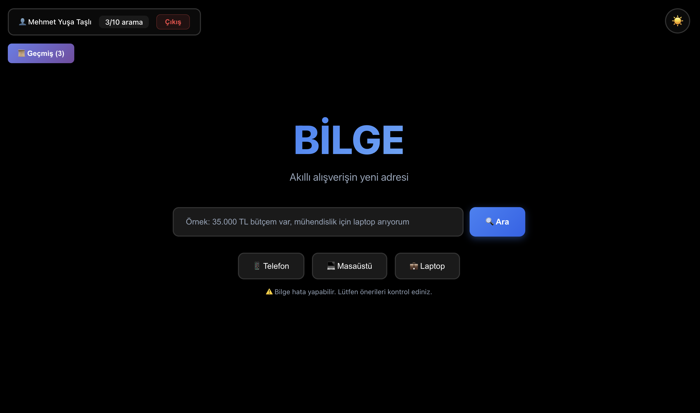
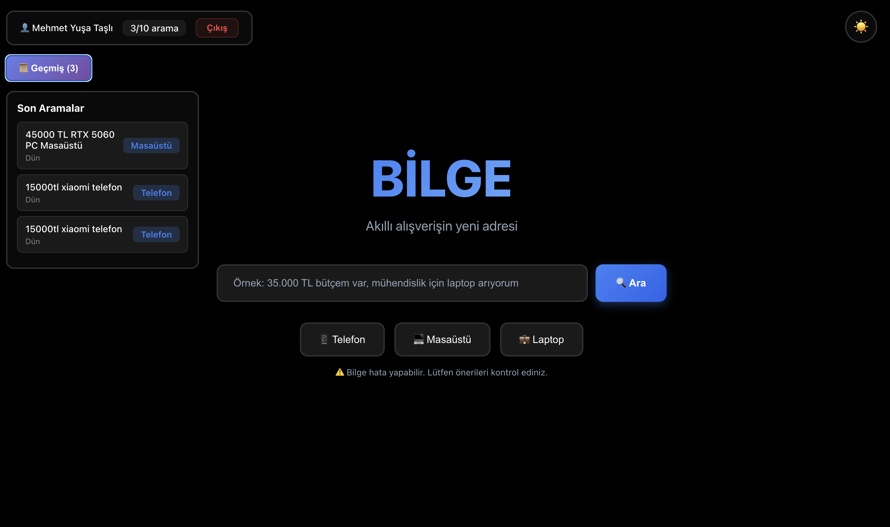
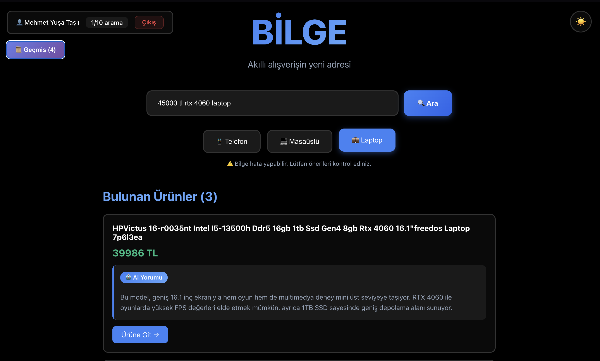
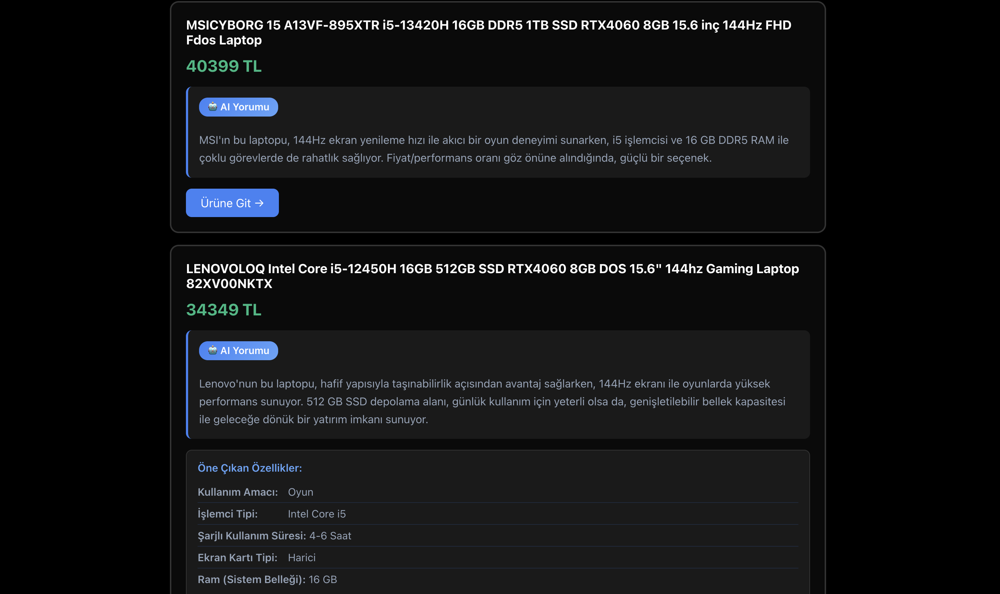

# 🤖 Tech Advisor

AI destekli Türk e-ticaret sitelerinden teknoloji ürünü önerisi sistemi.

## 🚀 Özellikler

- 🔍 Akıllı ürün arama (telefon, laptop, masaüstü)
- 🤖 GPT-4 ile AI analiz ve yorumlar
- ⚡ Redis cache (anında sonuç)
- 🐳 Docker ile kolay kurulum

## 📦 Kurulum
```bash
# 1. Projeyi indir
git clone https://github.com/KULLANICI_ADIN/tech-advisor.git
cd tech-advisor

# 2. .env dosyası oluştur
cp backend/.env.example backend/.env
# API keylerini .env'ye ekle!

# 3. Başlat
docker-compose up -d

# 4. Aç
# Frontend: http://localhost:3000
# Backend: http://localhost:8000
```

## 🛠️ Teknolojiler

- FastAPI + React
- PostgreSQL + Redis
- Selenium + OpenAI
- Docker

## 👨‍💻 Geliştirici

Mehmet Yuşa Taşlı

---

## 📸 Screenshots

### Ana Sayfa


### Arama Geçmişi


### Arama Sonuçları


### Detaylı Ürün Analizi


---

## 🔗 Links

**GitHub:** https://github.com/yusatasli/tech_advisor
